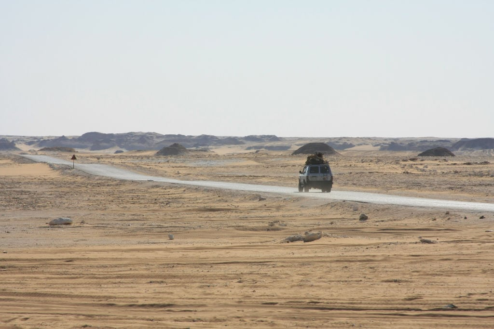

This is some Text with an image below. Hugo will resize images to a long side size of 800 Pixels automatically with this theme--the original file is untouched, so you can simply use images without any worries on optimization, Hugo does that for you:

As you can see, the image's title is shown as a caption.

## Structure

The page bundle feature requires a folder with a distinct name (here: `2020-11-28-demo-page`).

The folders main article *must* be named `index.md`.

Assets are put into that folder too. For list pages to show thumbnails it is necessary that the post's main image is linked in frontmatter with *full path*, see above in this page's frotmatter: `image: "/blog/2020-11-28-demo-page/2007-schwarzewueste.jpg"`. This image will only show on list pages--if you want a copy in single view, you must link it like in the examle above. This gives you control over where images show and the possibility to have an explicit thumbnail for each article in list view.

## Hugo's Shortcodes

Shortcodes are an easy way to inlude content from e.g. Twitter or Youtube:

**Example Twitter**:

 renders as:



**Example Youtube**:

 renders as:



Now try to print this page so you can see the print style in action.

By the way: launch hugo with `hugo --gc --minify` for automatic clean up an smaller files.
